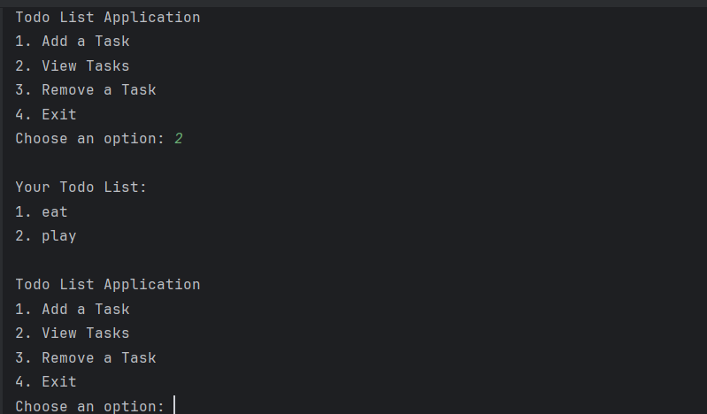

# Todo List Application

A simple **Todo List App** built in **Java** that lets you add, view, and remove tasks through a command-line interface.

## Features:
- Add, view, and remove tasks.
- Easy-to-use CLI.

## Screenshot
Here’s a screenshot of the app’s output:



## How to Run
1. Clone this repository:
   ```bash
   git clone https://github.com/yourusername/todolistapp.git
